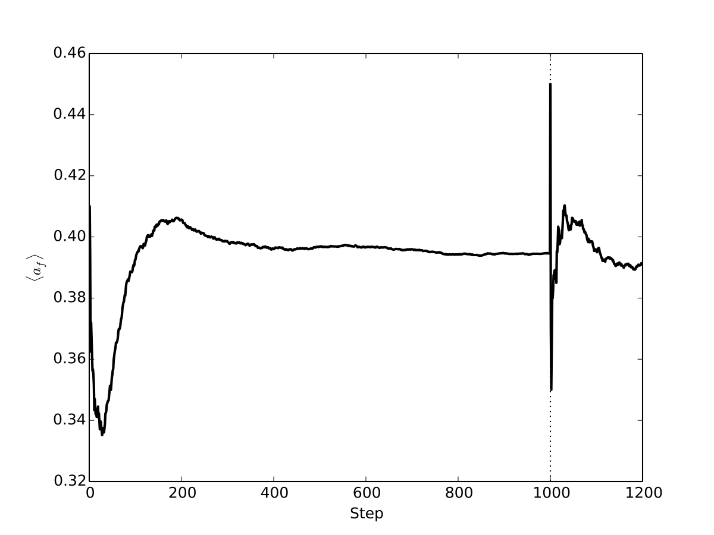
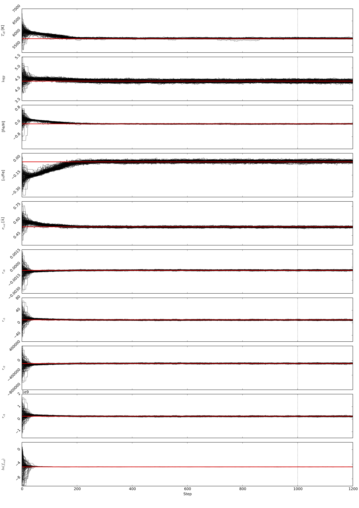
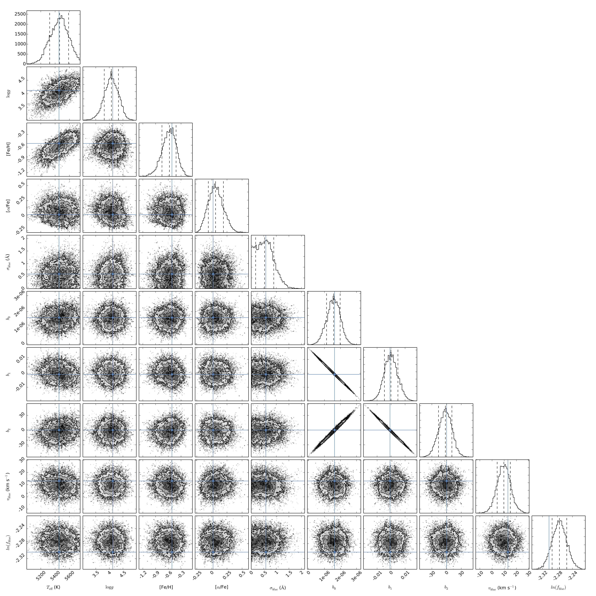

.. Inferring the stellar parameters of the Sun 

===================================
Example: Inferring Solar parameters 
===================================

In this example we'll use a high-resolution (R ~ 20k), high S/N (~150 per pixel) twilight spectrum to infer the
stellar parameters of the Sun. We'll use the `AMBRE synthetic stellar library <http://adsabs.harvard.edu/abs/2012A%26A...544A.126D>`_
as the model grid, which has four parameters: effective temperature (:math:`T_{\rm eff}`), surface gravity (:math:`\log{g}`),
mean metallicity ([Fe/H]) and mean :math:`\alpha`-element enhancement ([:math:`\alpha`/Fe]). For the data, we'll
use a `FLAMES/GIRAFFE spectrum <http://eso.org/observing/dfo/quality/GIRAFFE/pipeline/solar.html>`_ which is available
in ASCII format from `here <http://astrowizici.st/sick/flames-solar.txt>`_.

.. note::
   This example was presented in Section 3 of the ``sick`` paper.

Download the models and data
^^^^^^^^^^^^^^^^^^^^^^^^^^^^

First we'll download the model that we need. You could actually use either the ``ambre-ges`` or ``ambre-ges-hr21``
pre-cached models because they both cover the spectral range required. To download the grid::

    sick download ambre-ges-hr21

And you can download the FLAMES/GIRAFFE twilight spectrum with the following command::

    wget http://astrowizici.st/sick/flames-solar.txt

Now you should have the following files in your current working directory::

    $ ls *
    flames-solar.txt 

    ambre-ges-hr21:
    dispersion-points.memmap     fluxes.memmap
    grid-points.pickle           model.yaml        

Edit the ``model.yaml`` file such that redshift is ignored, no outlier modelling is disabled, convolutions are included,
and that the continuum is modelled by a second order polynomial. We'll also mask out certain regions of the spectrum that
we know are not well fit by the model, primarily due to non-LTE effects. 

Mask out the regions between: 8479-8499,
8541.1-8543.1, 8661.1-8663.1, 8501.0-8503.7 Angstroms, and everything redder than 8670.0 Angstroms.

For the solver settings, enable optimisation and set 10000 initial samples. Use 100 walkers to burn-in for 1000 
steps and then sample the posterior for 200 steps. After all is done, your updated ``model.yaml`` file should 
look something like this::

    solver:
      optimise: yes
      initial_samples: 10000
      walkers: 100  
      burn: 1000
      sample: 200
      threads: 24

    channels:
      points_filename: grid-points.pickle
      flux_filename: fluxes.memmap 
  
      hr21:
        dispersion_filename: dispersion.memmap

    outliers: no

    normalise:
      hr21:
        method: polynomial
        order: 2

    redshift:
      hr21: no

    convolve:
      hr21: yes

    masks:
      hr21:
        - [8497.0, 8499.0]
        - [8541.1, 8543.1]
        - [8661.1, 8663.1]
        - [8670.0, 10000.]
        - [8501.0, 8503.7]

 
Inference
^^^^^^^^^

We'll use the ``sick`` command line tool in this example::

    # This may take a few minutes.
    sick solve --output-prefix=solar ambre-ges-hr21/model.yaml flames-solar.txt

If the inference is taking too long then you can increase the number of ``threads`` in the solver settings to take
advantage of multiple cores, decrease the number of burn-in steps (Pro Tip: use at least 300 for this example), or
decrease the number of walkers.

Post-processing
^^^^^^^^^^^^^^^

If all has gone to plan, the ``sick solve`` command line tool has produced a number of publication ready figures for
you. Let's look at ``solar-acceptance.pdf`` and ``solar-chain.pdf``:

Looks pretty good! The acceptance fractions look reasonable, and the chain values seem to have converged from about 300 steps.
This means we wasted CPU cycles burning to 1000 steps, but at least we're confident everything has converged.
 
Now let's see ``solar-corner.pdf``, which shows us the posterior samples for *just* the astrophysical parameters of
interest:

Our inferred stellar parameters for the Sun are:

:math:`T_{\rm eff} = 5770^{+20}_{-14}`
:math:`\log{g} = 4.40^{+0.06}_{-0.05}`
:math:`[{\rm Fe/H}] = -0.07^{+0.01}_{-0.01}`
:math:`[\alpha/{\rm Fe}] = -0.03^{+0.01}_{-0.01}`

Which is in excellent agreement with the accepted values for the Sun of :math:`T_{\rm eff} = 5777` K and :math:`\log{g} = 4.445`.
The :math:`\alpha`-element enhancement is a little bit discrepant from [:math:`\alpha`/Fe] = 0, and the difference worsens for
mean metallicity [Fe/H], which we would expect to be closer to 0 (by definition). However these discrepancies aren't very worrying: small abundance
offsets are observed between most stellar spectroscopic studies, and it's more important to look at differential abundance results.
Surface gravity is the most unconstrained (stellar) parameter, and the fact that we can precisely and accurately infer it with
just a small chunk of spectrum (in the Gaia range, no less) is very encouraging!
